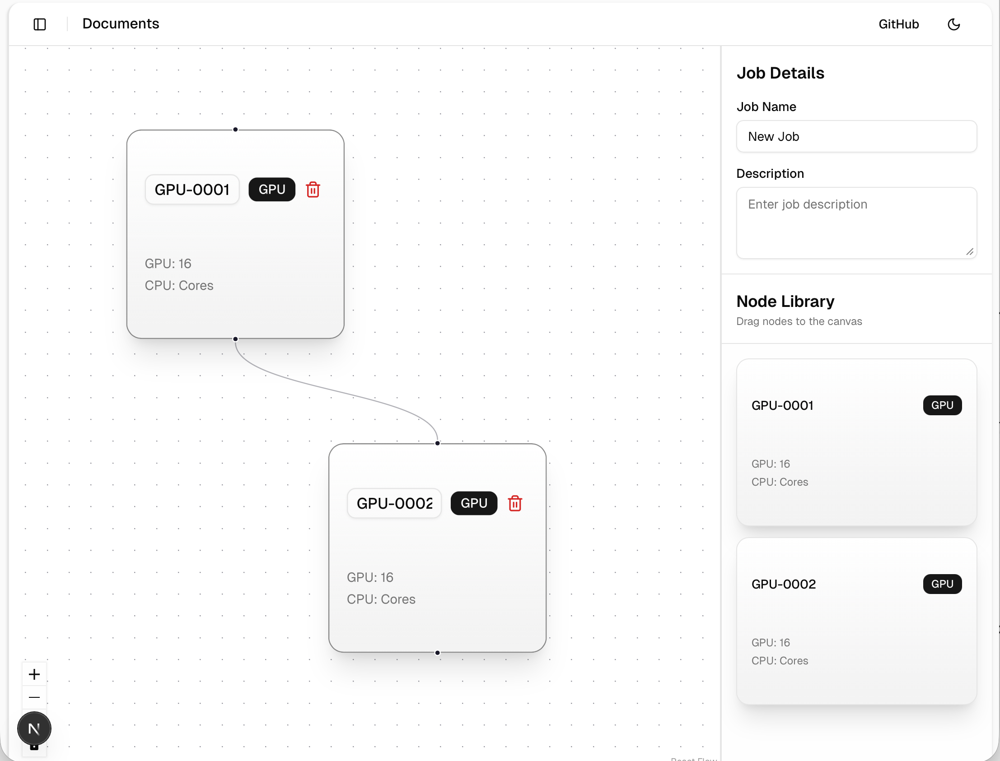
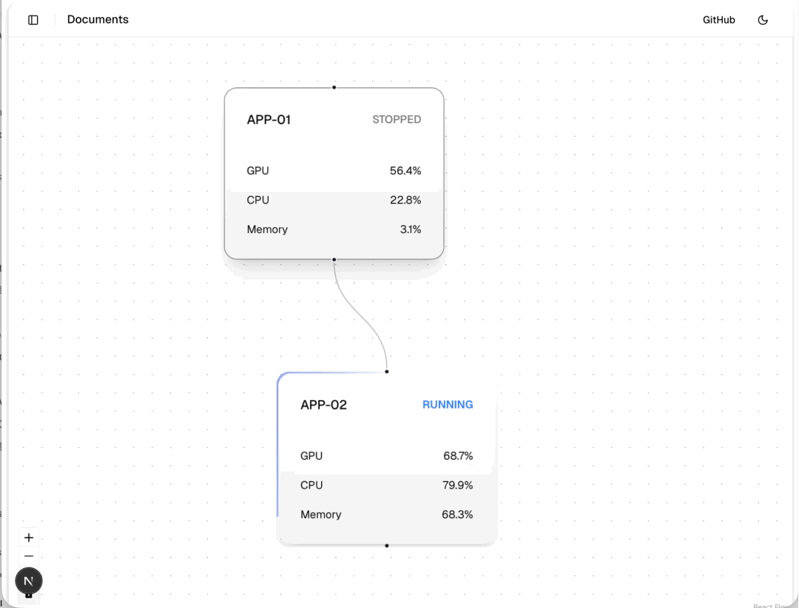

# React Flow를 활용한 실시간 서버 모니터링

- Monorepo 구조
- React flow를 사용하여 서버관리 및 모니터링을 효과적으로 지원한다. 




## 🍕 주요 라이브러리

- React
- Next.js
- shadcn/ui
- Tailwindcss
- Zustand
- React flow

## 🍔 주요 리소스 구조

```
root
├─ .aiassistant              # AI-Agent 가이드라인 프롬프트
├─ prompts                   # 기능 프롬프트
├─ apps.web
│  ├─ app.job                # Job 관리  
│  └─ prompts                # API Swagger json 프롬프트
└─ packages                  # Core 패키지, shadcn/ui 패키지 
```